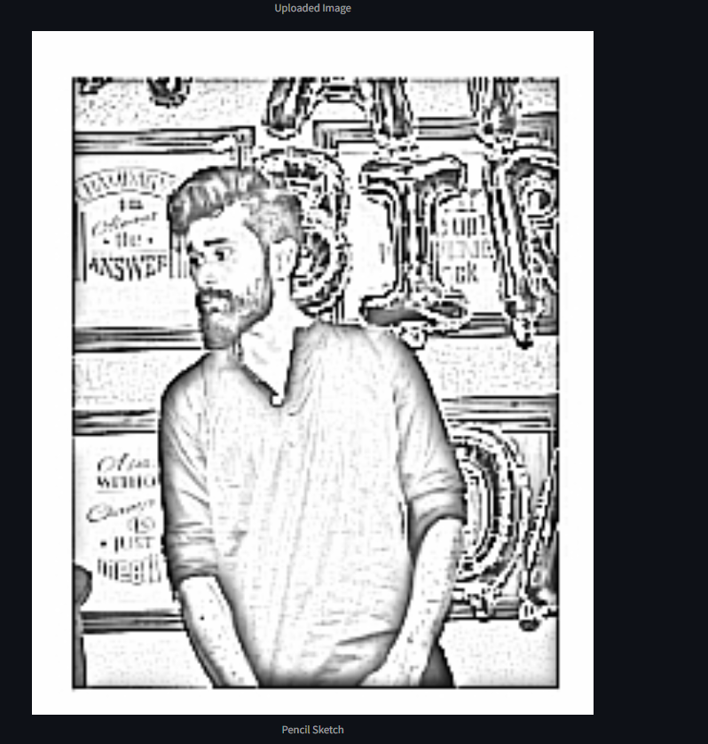

# Image to Pencil Sketch Converter

This is a Streamlit-based web application that converts images into pencil sketch-style images. Users can upload their images, view the sketch effect, and download the processed sketch. The app gives a natural pencil-drawn look to the images.



## Features
- Upload an image in `.jpg`, `.jpeg`, or `.png` format.
- Convert the uploaded image into a pencil sketch.
- Download the converted pencil sketch as a `.png` file.
- Interactive UI built with Streamlit.
- Made by [Shailendra Singh](https://ssinghportfolio.netlify.app/).

## How It Works
The app processes the image by:
1. Converting the uploaded image to grayscale.
2. Inverting the grayscale image.
3. Applying a Gaussian blur to soften the image.
4. Creating a pencil sketch effect using a dodge blend.
5. Enhancing the pencil strokes using edge detection (Laplacian).

## Getting Started

### Prerequisites
- Python 3.x installed
- `pip` installed

### Libraries Used
- `streamlit`
- `opencv-python`
- `numpy`
- `Pillow`

### Installation

1. Clone this repository:
    ```bash
    git clone https://github.com/shailendrasingh-cyber/Image-to-pencil-sketch-converter
    ```

2. Navigate to the project directory:
    ```bash
    cd Image-to-pencil-sketch-converter
    ```

3. Install the required dependencies:
    ```bash
    pip install -r requirements.txt
    ```

4. Run the Streamlit app:
    ```bash
    streamlit run app.py
    ```

5. Open the URL provided by Streamlit in your web browser to interact with the app.

### Example
To convert an image to a pencil sketch:
1. Upload an image using the file uploader.
2. Click the "Convert to Sketch" button.
3. Download the resulting sketch using the "Download Sketch" button.

## Contributing
If you want to contribute to this project, feel free to submit a pull request.

## License
This project is licensed under the MIT License. See the [LICENSE](LICENSE) file for more details.

